# Домашнее задание к занятию 5 «Тестирование roles»

## Подготовка к выполнению

1. Установите molecule и его драйвера: pip3 install "molecule molecule_docker molecule_podman.
- готово.
2. Выполните docker pull aragast/netology:latest — это образ с podman, tox и несколькими пайтонами (3.7 и 3.9) внутри.
- готово.

## Основная часть
 Ваша цель — настроить тестирование ваших ролей.
 Задача — сделать сценарии тестирования для vector.
 Ожидаемый результат — все сценарии успешно проходят тестирование ролей.

### Molecule
1. 
```
- (venv-ansible) roman@UbuntuS4:~/homeworks/03_ansible/task5/roles/clickhouse$ molecule test -s ubuntu_xenial
WARNING  Driver docker does not provide a schema.
ERROR    Failed to validate /home/roman/homeworks/03_ansible/task5/roles/clickhouse/molecule/ubuntu_xenial/molecule.yml
```
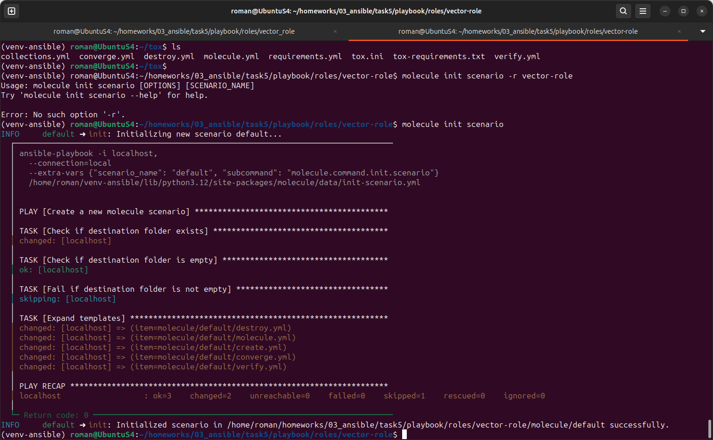
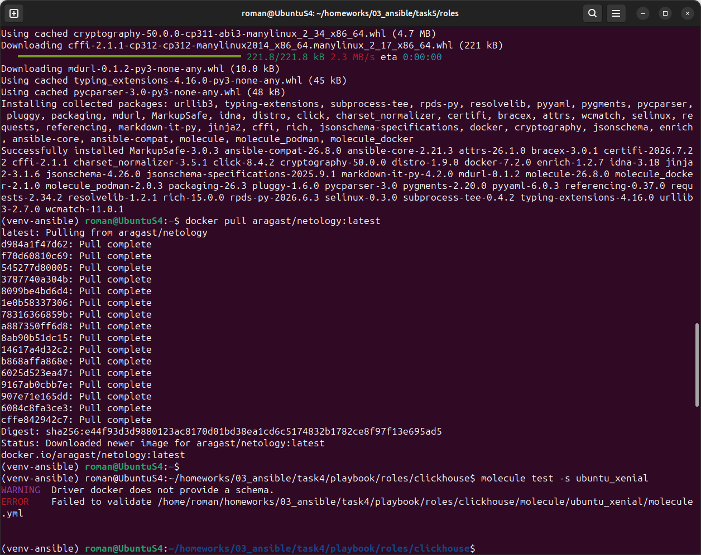

2. Перейдите в каталог с ролью vector-role и создайте сценарий тестирования по умолчанию при помощи molecule init scenario --driver-name docker.
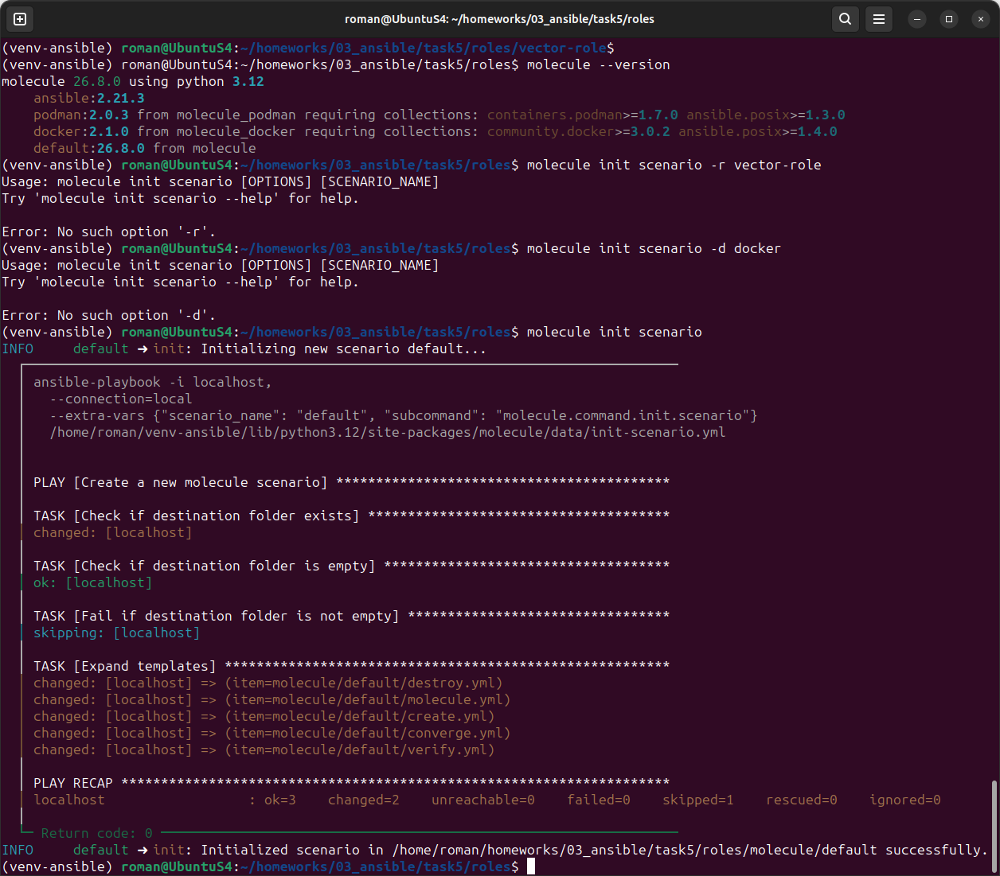

- теперь только molecule init scenario.
-r раньше использовался для указания роли при инициализации, но теперь Molecule всегда инициализирует сценарий внутри текущей роли, поэтому флаг убрали.
-d / --driver при инициализации тоже убрали: драйвер задают в YAML-конфигурации, чтобы можно было гибко менять настройки без пересоздания сценария.

3. 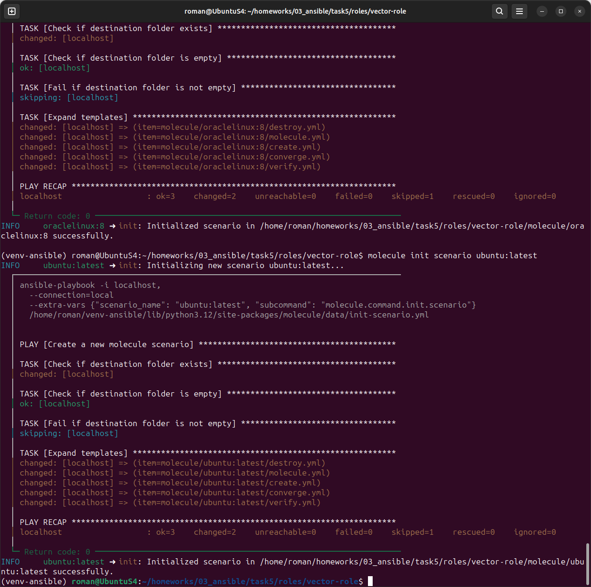
4.                                     
5. 

### Tox


1. 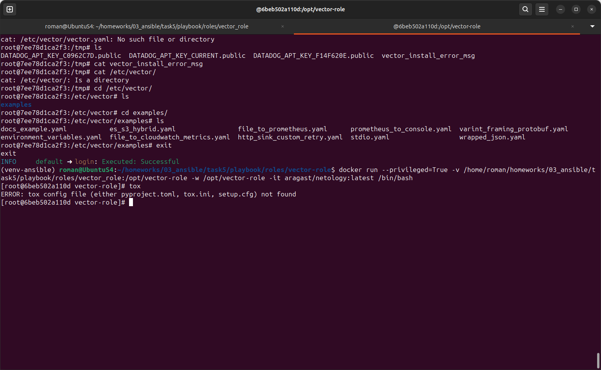
-  
2. 
3. 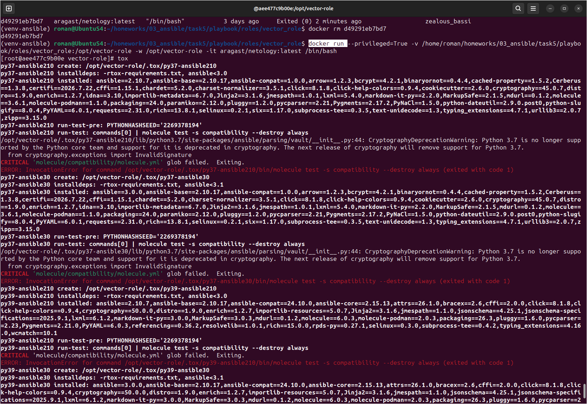  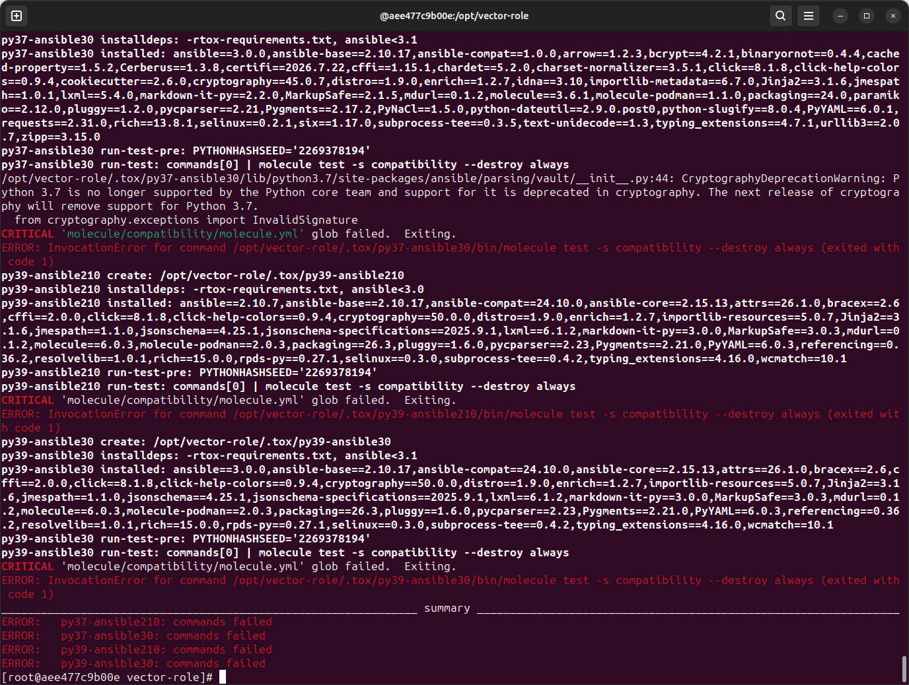 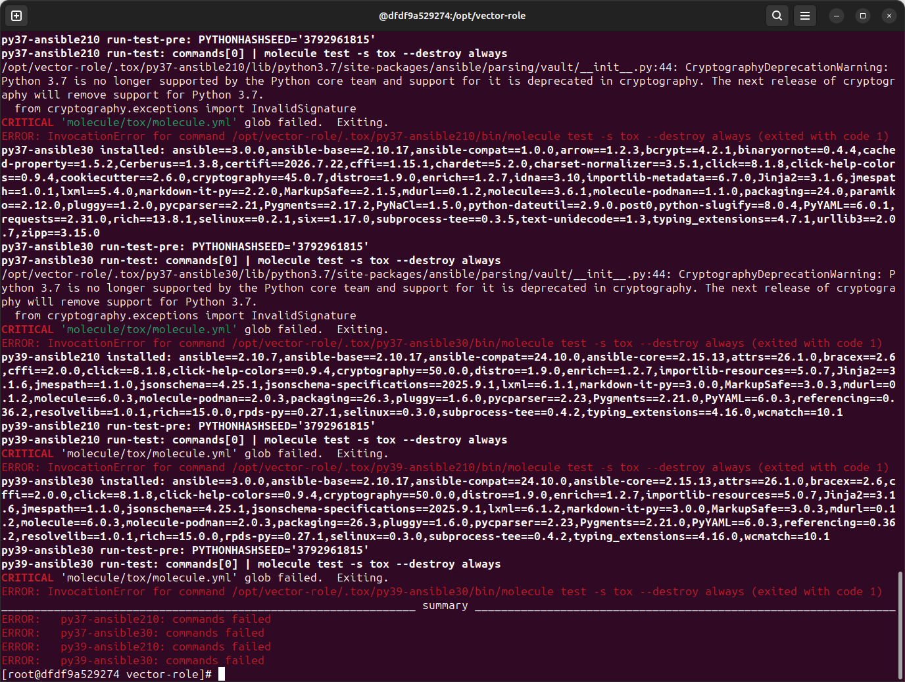
4. 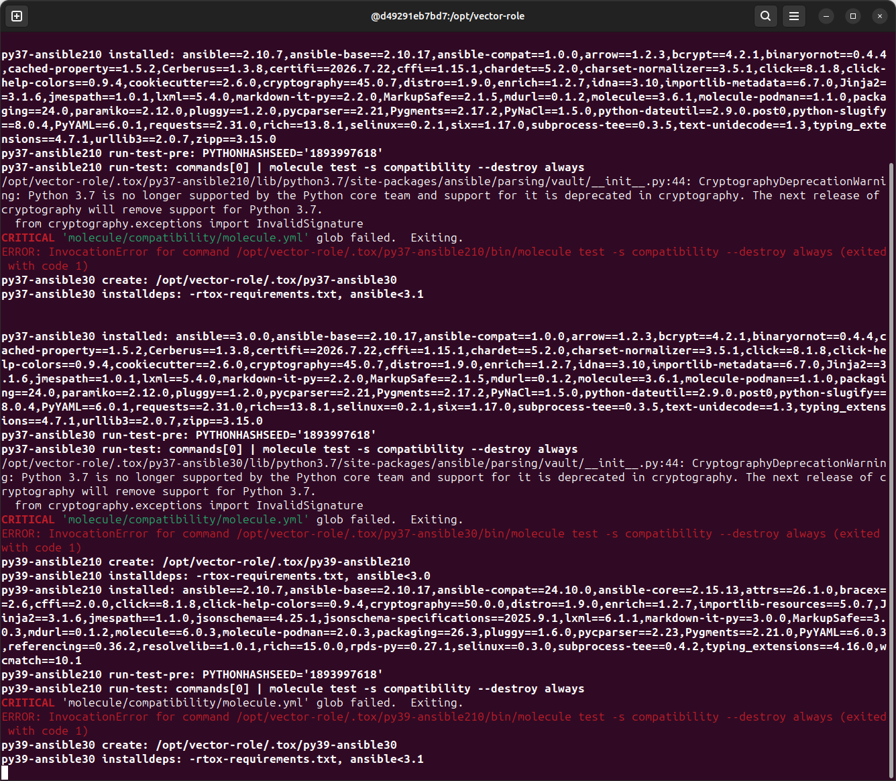 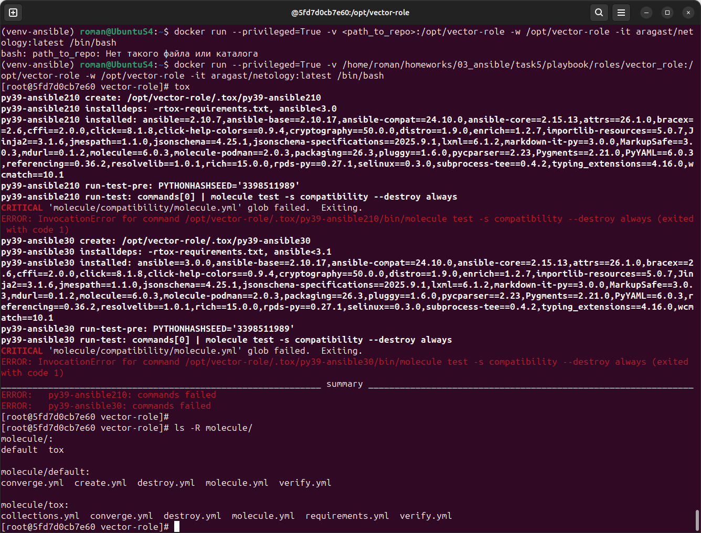 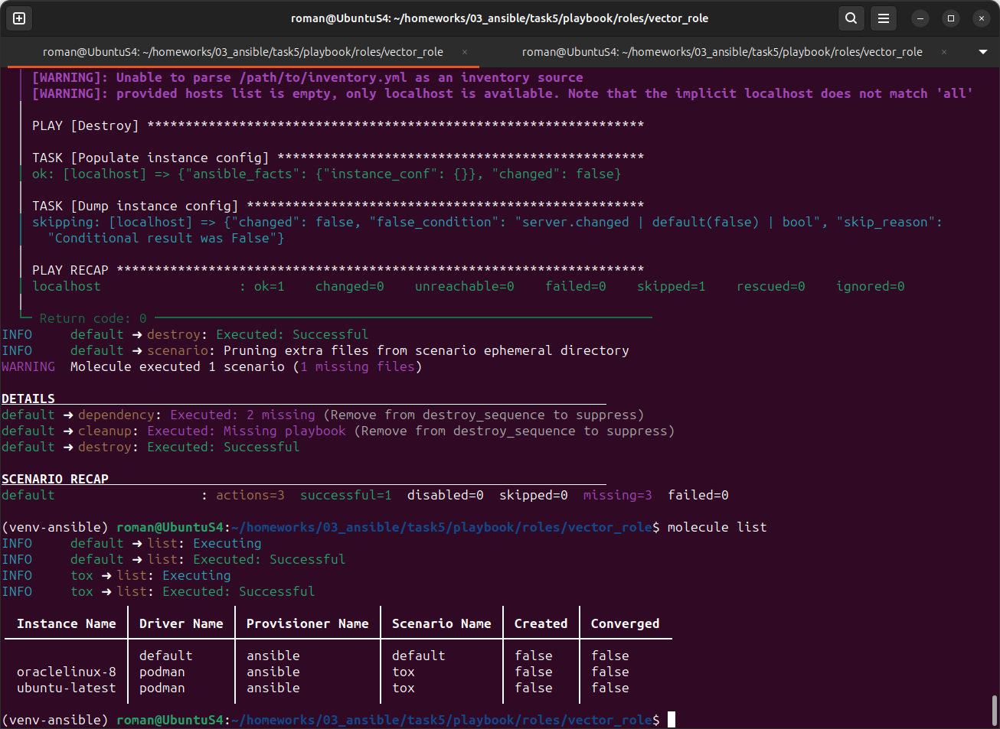
5. 
- molecule -s tox test: Флаг -s использовался в старых версиях Molecule для указания сценария.    В новых версиях он удален.
molecule matrix -s tox test: команда matrix больше не существует — её заменила команда matrix show.

6. Запустите команду tox. Убедитесь, что всё отработало успешно.


7. Добавьте новый тег на коммит с рабочим сценарием в соответствии с семантическим версионированием.

 v2.5.1 - Commit bd2cc23 :
 https://github.com/mrelroman-lang/vector-role/commit/bd2cc23046d6e8dade487a43797015ad63a3f654 

После выполнения у вас должно получится два сценария molecule и один tox.ini файл в репозитории. Не забудьте указать в ответе теги решений Tox и Molecule заданий. В качестве решения пришлите ссылку на ваш репозиторий и скриншоты этапов выполнения задания.

### Как оформить решение задания
Выполненное домашнее задание пришлите в виде ссылки на .md-файл в вашем репозитории.