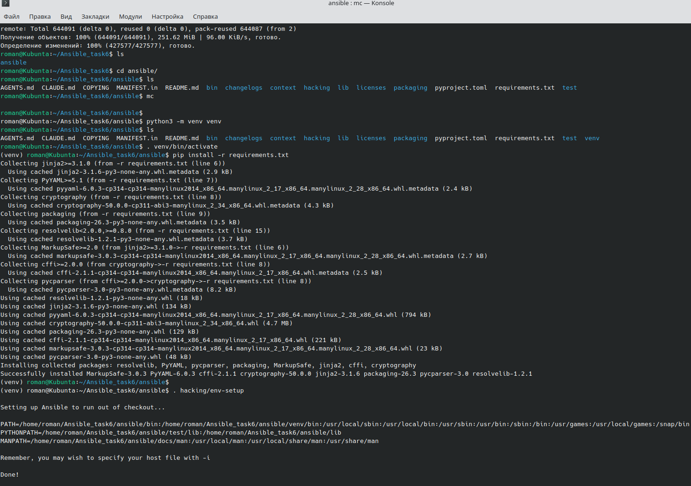
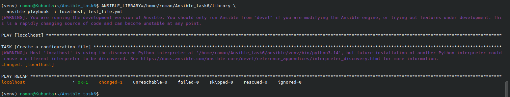
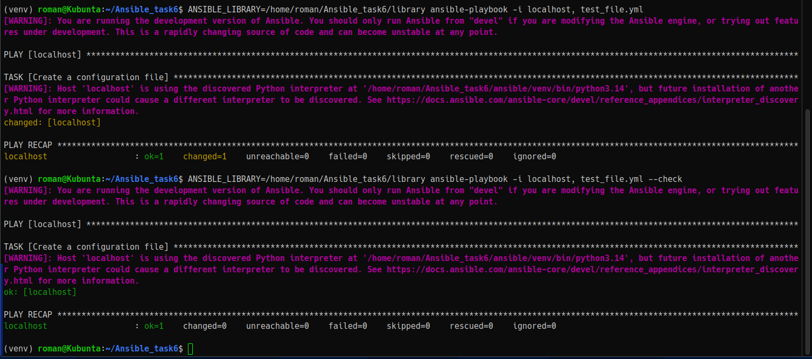
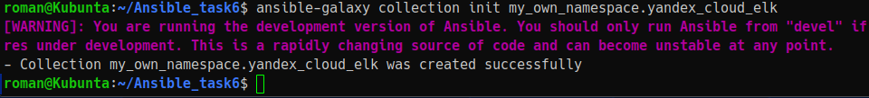
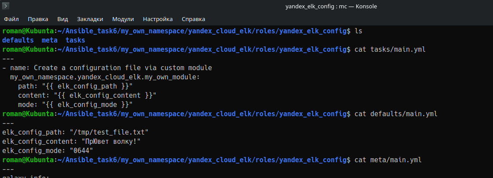
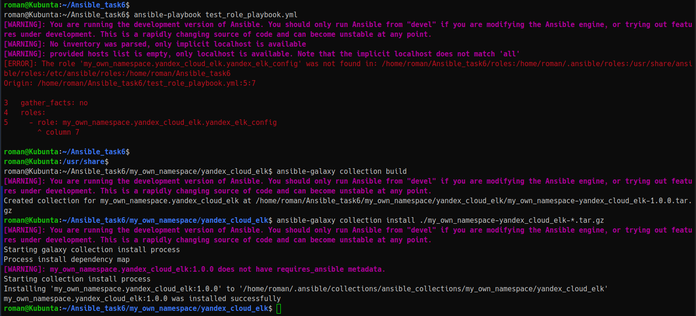
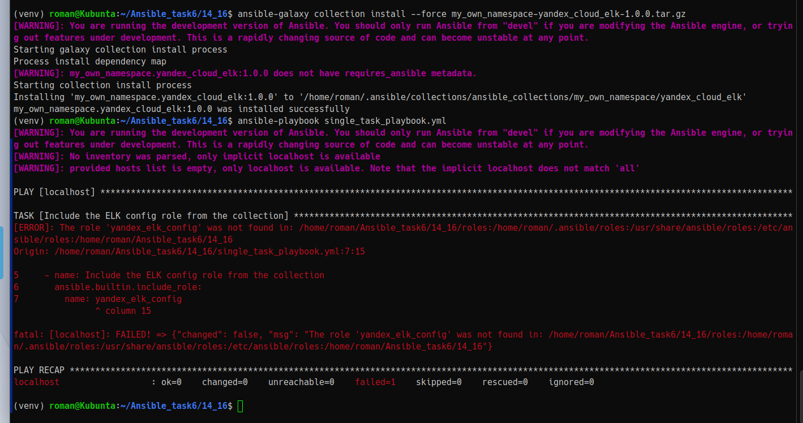

# Домашнее задание к занятию 6 «Создание собственных модулей»

## Подготовка к выполнению

## Основная часть

Ваша цель — написать собственный module, который вы можете использовать в своей role через playbook. Всё это должно быть собрано в виде collection и отправлено в ваш репозиторий.

** Проверьте module на исполняемость локально.

** Напишите single task playbook и используйте module в нём.
** Проверьте через playbook на идемпотентность.

** Инициализируйте новую collection:

** Single task playbook преобразуйте в single task role и перенесите в collection. У role должны быть default всех параметров module.

** Создайте .tar.gz этой collection: `ansible-galaxy collection build` в корневой директории collection.

** Установите collection из локального архива,
** Запустите playbook, убедитесь, что он работает.

** В ответ необходимо прислать ссылки на collection и tar.gz архив, а также скриншоты выполнения пунктов 4, 6, 15 и 16.
- https://github.com/mrelroman-lang/my_own_collection
- https://github.com/mrelroman-lang/homeworks/tree/main/03_ansible/task6
