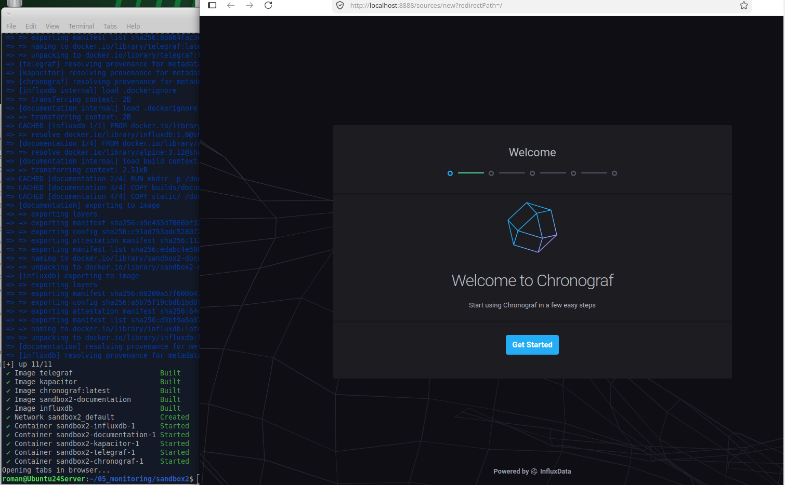
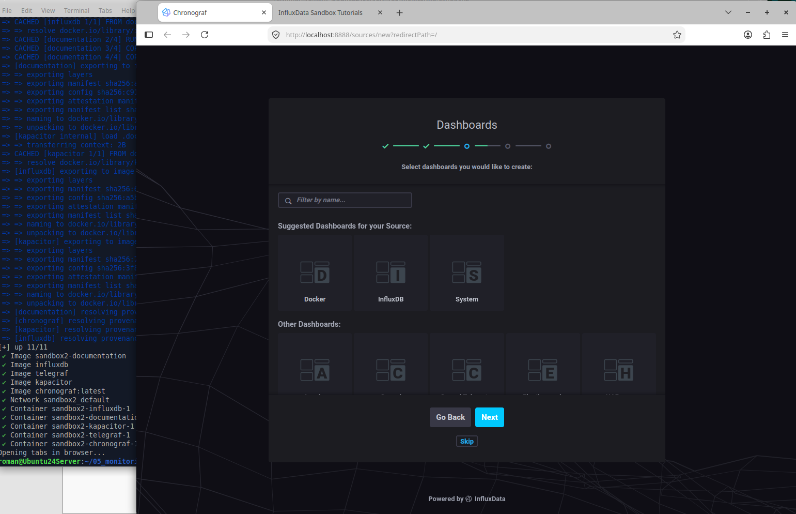
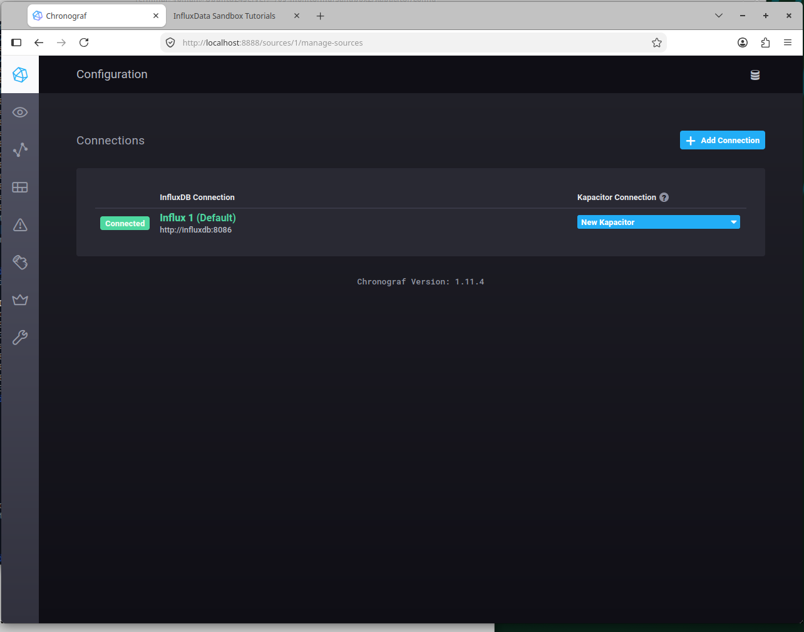
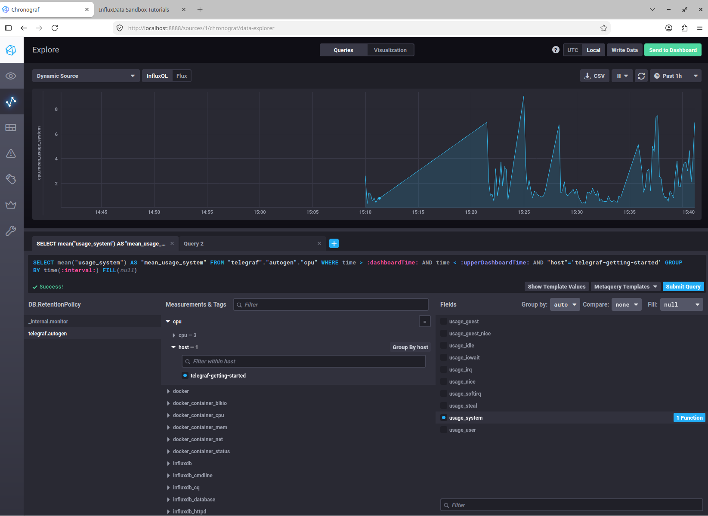
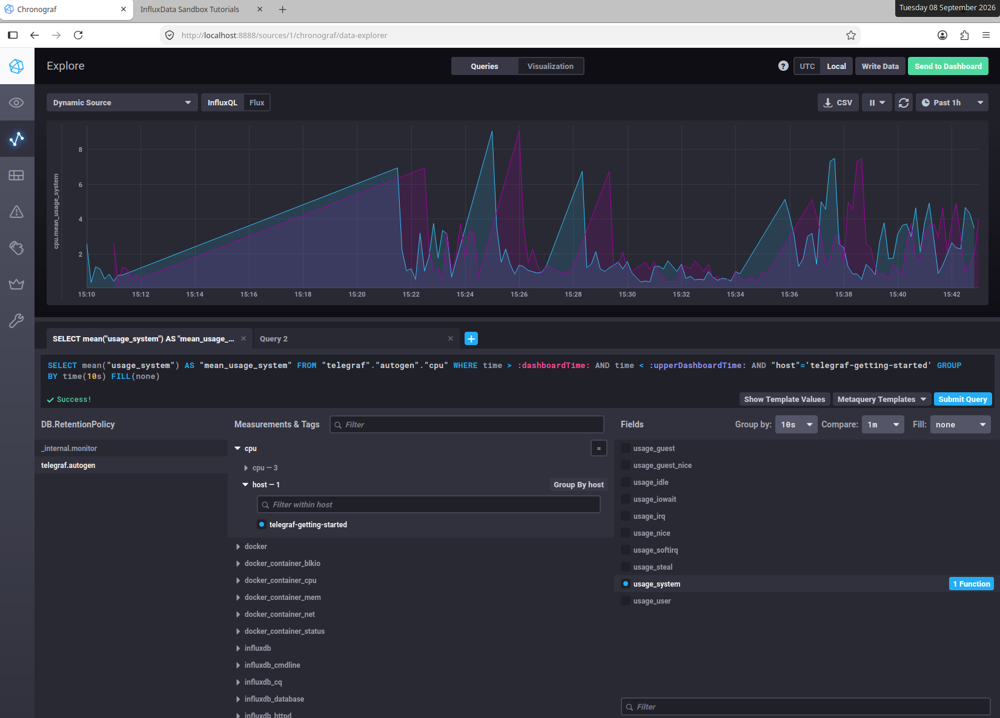
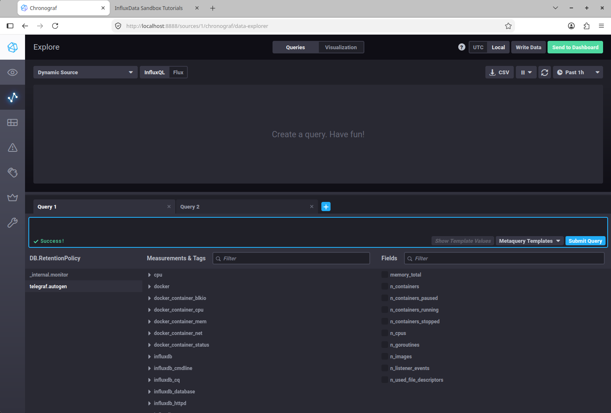

# Домашнее задание к занятию "13.Системы мониторинга"

## Обязательные задания

### 1.
  1.a Для вычислений - CPU Utilization (загружен ли процессор вычислениями) и CPU Saturation (забита ли очередь на обработку)

  1.b  с выдачей текстовых отчетов которые сохраняются на диск. - Disk Space Usage  сколько свободного места на диске куда пишутся отчеты, и 
Disk I/O Wait (iowait)перег8руженность работы подсистемы ввода/вывода диска.

  1.c  Взаимодействие по протоколу http. - HTTP Request Rate -частота запросов в секунду по кодам ответа (2xx, 4xx, 5xx) -есть ли ошибки сервера или просто отсутствие трафика, и HTTP Latency - задержка/время отклика

### 2. 
 ##### С менеджером нужно разговаривать про SLA (Service Level Agreement) и SLO (Service Level Objective). 
 
	Доступность (Availability): например > 99.9%.

	Скорость (Speed): % отчетов, выданных вовремя (пример > 95%).

	Качество (Quality): % ошибок при сохранении (пример < 1%).

	Запас прочности (Capacity): Сколько дней осталось до конца места/ресурсов (например тревога, если меньше 7).

### 3. 
 ##### Нужно обеспечить наблюдаемость минимальными средствами.
  
 3.a - Канал экстренного оповещения: Error Tracking & Alerting (Приоритет №1)
 
 Отправку каждой ошибки уровня ERROR или FATAL в отдельный технический канал в мессенжер или почту (в нынешних условиях недоступности мессенджеров).
 Например Logback в Java (SMTPAppender), можно развернуть Sentry сommunity-версию (бесплатно, потребляет немсного ресурсов).

 3.b Доступ к первичным логам и к консоли.
 
 Централизованный просмотр через SSH (rsyslog/syslog-ng)- бесплатное решение уровня "минимум", ограниченный доступ только на чтение файлов.
 Ограничение объема (Logrotate). Мы хранили полные логи приложений (кроме финансовых логов) только за последние 2-3 дня затем месяц в .gz архивах, остальное удаляли.

### 4. 
 -Ошибка в отсутствующих типах запросов при расчете формулы.
 
 SLA измеряет доступность сервиса с точки зрения клиента, а для него любой трафик, завершившийся ошибкой в том числе и сетевом уровне - это такая же ошибка.
 формула: summ_2xx_requests / summ_all_http_responses считает только соединения, запрос дошёл до веб-сервера, обработан кодом и возвращен ответ.
 
 Оставшиеся 30% трафика «исчезают» так как это ошибки уровней L3/L4 (сетевого), например сonnection refused или сonnection timed out.
 
 Для правильного ответа нужно считать запросы на уровень ниже — там, где фиксируется сам факт установления сессии.
 
	Метрики L4/L7 балансировщика или "золотые" сигналы методологии RED:
	
	Rate (Частота): Запросов в секунду.
	Errors (Ошибки): Процент ошибок. Ошибкой считается всё, что НЕ 2xx, ПЛЮС все инциденты типа Network Refused / Network Timeout.
	Duration (Длительность): Латентность.

### 5.  Опишите основные плюсы и минусы pull и push систем мониторинга.
 - Pull-модель (сервер забирает данные): 
 Плюсы: безопасность (закрыт исходящий трафик), сервер сам контролирует нагрузку, единый формат данных. 
 Минусы: нужен Service Discovery для новых подов, задержка обнаружения упавшего хоста, сложно мониторить кратковременные задачи и устройства за NAT.

- Push-модель (приложение отправляет данные):
 Плюсы: мгновенное обнаружение падения по отсутствию трафика, подходит для эфемерных задач и cron-job'ов, работает через NAT без открытых портов.
 Минусы: приложение тратит свои ресурсы на сетевые вызовы, риск перегрузки сервера мониторинга при массовом рестарте сервисов, нужно прописывать адрес сервера в конфиг каждого приложения.

### 6.  Какие из ниже перечисленных систем относятся к push модели, а какие к pull? А может есть гибридные?
Pull: 
 Prometheus - классическая pull-модель
 Nagios.

Push:
 TICK (Telegraf): Telegraf пушит в базу данных InfluxDB.

Гибрид: 
 Zabbix
VictoriaMetrics.

### 7.
 Склонируйте себе репозиторий и запустите TICK-стэк:

- 
- 
- 

### 8.
Скриншот с отображением метрик утилизации cpu из веб-интерфейса:

- 
- 

### 9.
Добавьте в конфигурацию плагин docker

- 

Выполненное домашнее задание пришлите ссылкой на .md-файл в вашем репозитории.
