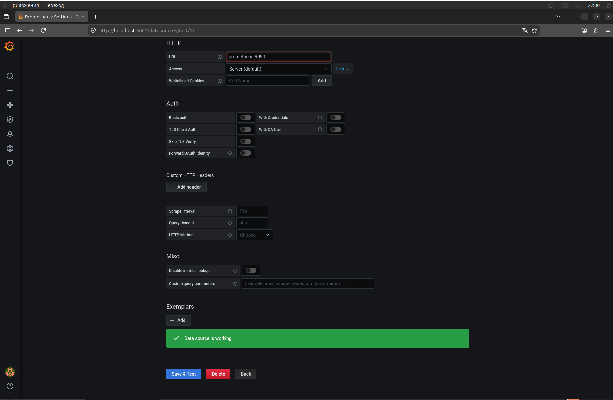
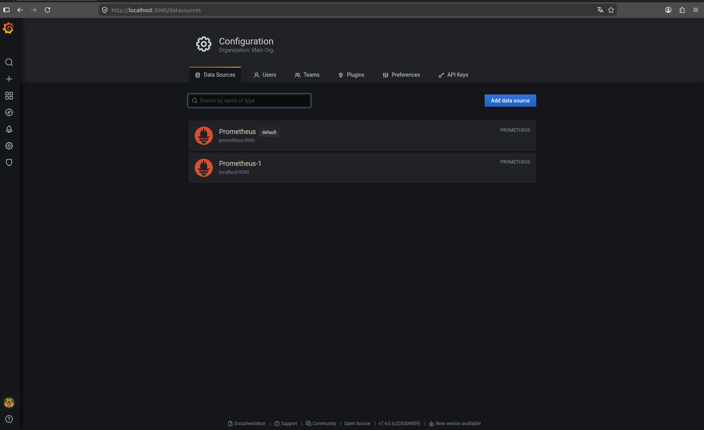
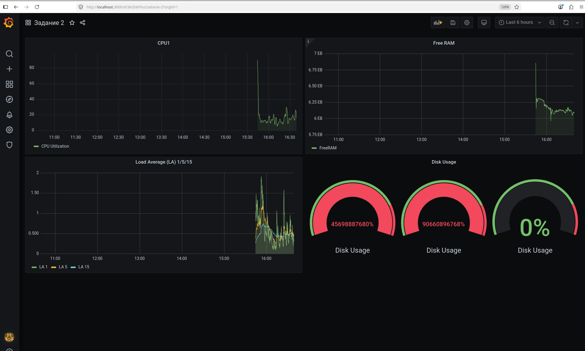
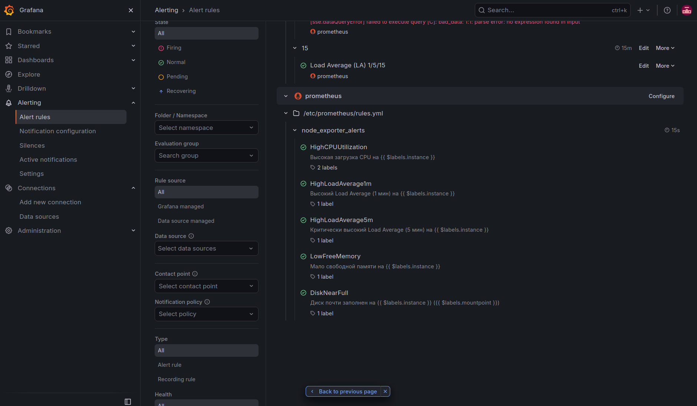
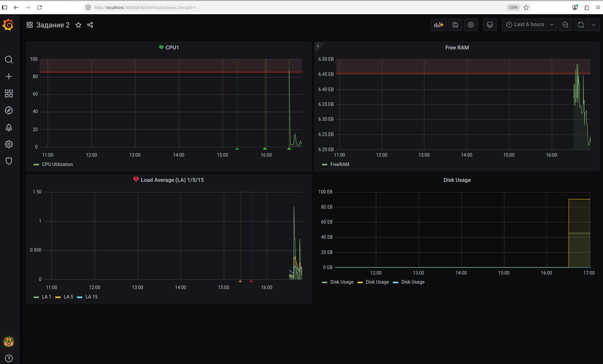
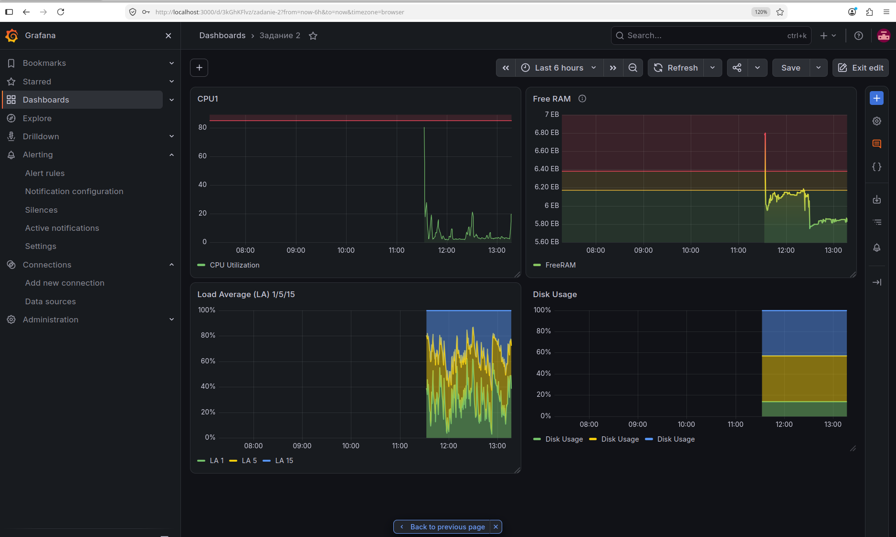
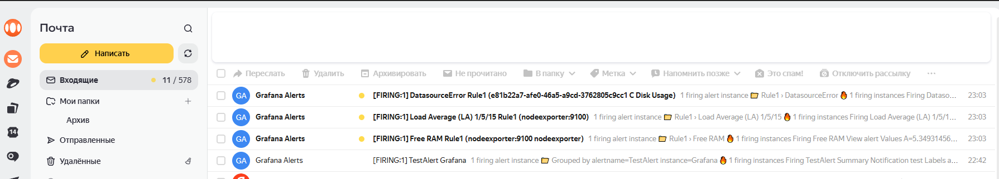
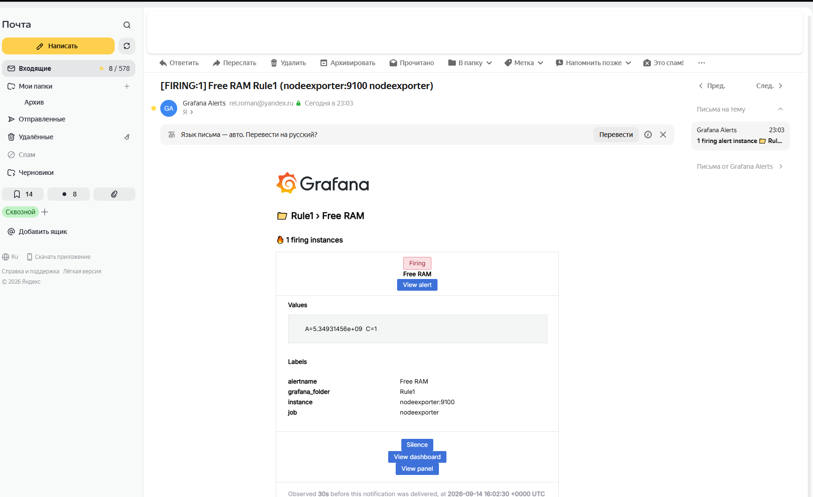

# Домашнее задание к занятию 14 «Средство визуализации Grafana»

### Задание 1

## Задание 2

Создайте Dashboard и в ней создайте Panels:

- (100 - (avg by(instance, mode) (irate(node_cpu_seconds_total{mode="idle"}[5m])) * 100) > 85)
- ((node_memory_MemFree_bytes + node_memory_Buffers_bytes + node_memory_Cached_bytes) / node_memory_MemTotal_bytes) < 0.1
- node_load1 > (count by(instance) (node_cpu_info) * 1) (1/5/15)
- ((1 - (node_filesystem_free_bytes / node_filesystem_size_bytes)) * 100 > 85) 

## Задание 3

## Задание 4

---
