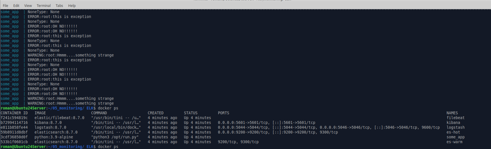
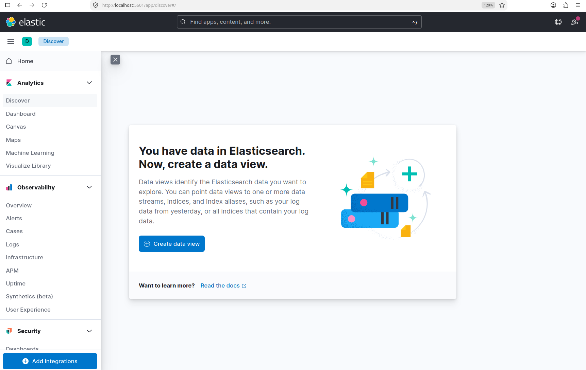
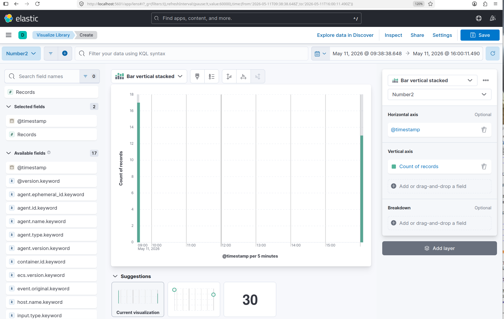
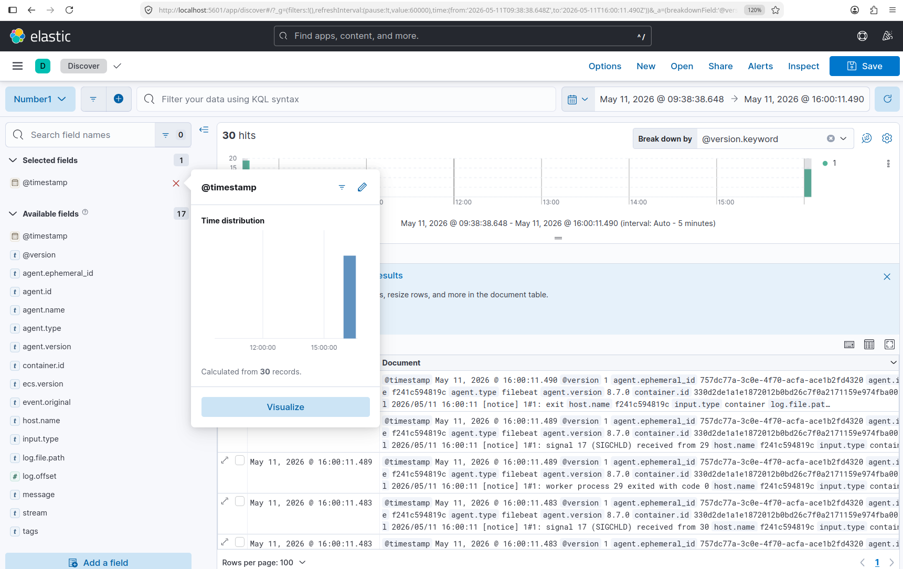
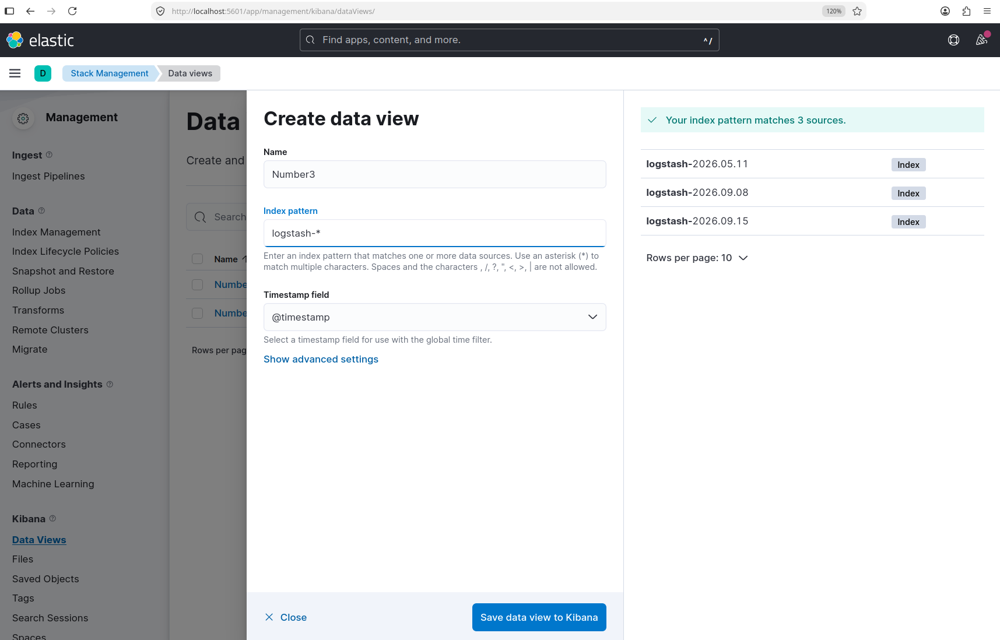

# Домашнее задание к занятию 15 «Система сбора логов Elastic Stack»

## Задание 1

Cкриншот `docker ps` через 5 минут после старта всех контейнеров

Cкриншот интерфейса kibana

## Задание 2

Cоздайте несколько index-patterns из имеющихся.

Перейдите в меню просмотра логов в kibana (Discover) и самостоятельно изучите, как отображаются логи и как производить поиск по логам.

Эти логи должны порождать индекс logstash-* в elasticsearch. 
 
 
--- 
