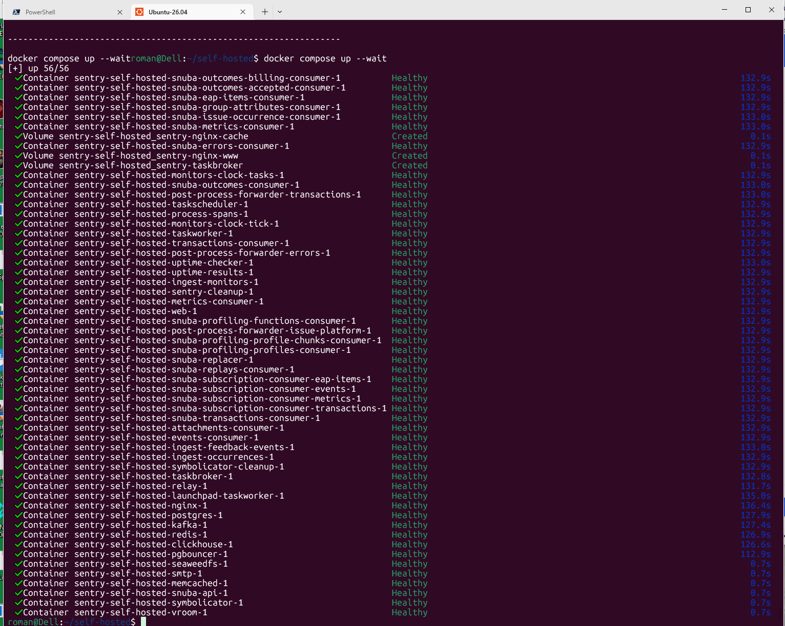
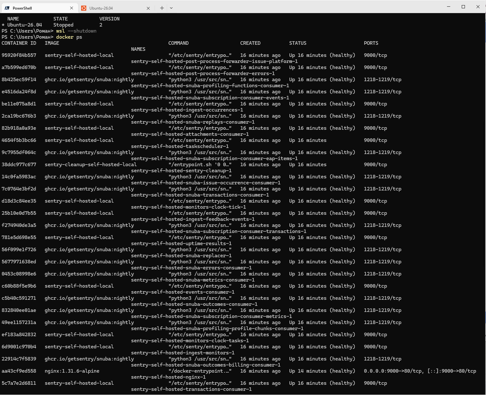
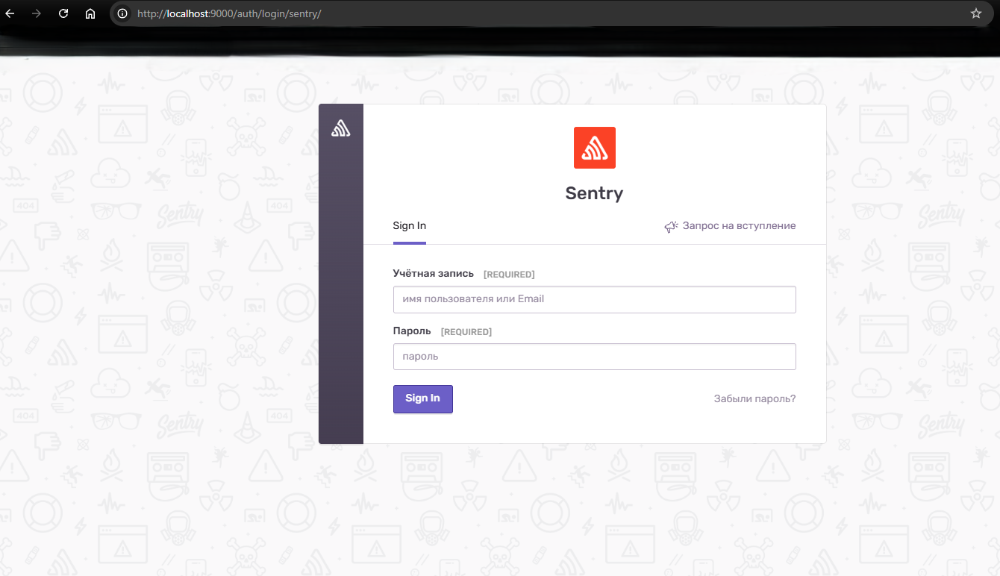
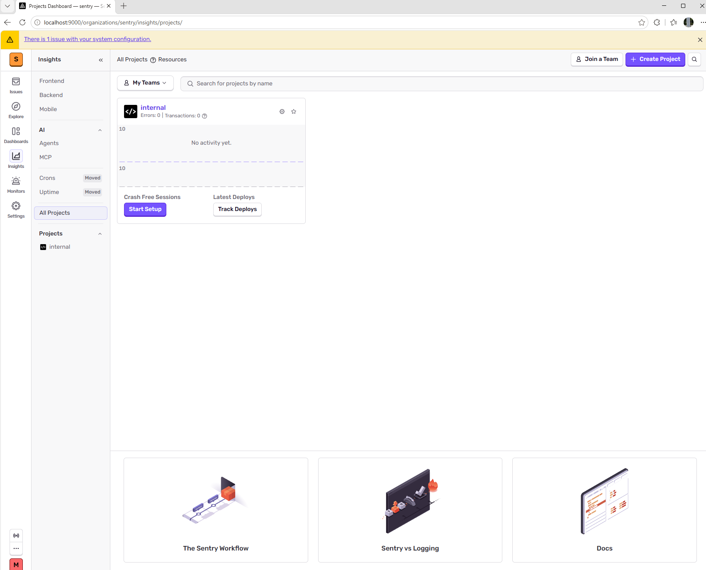
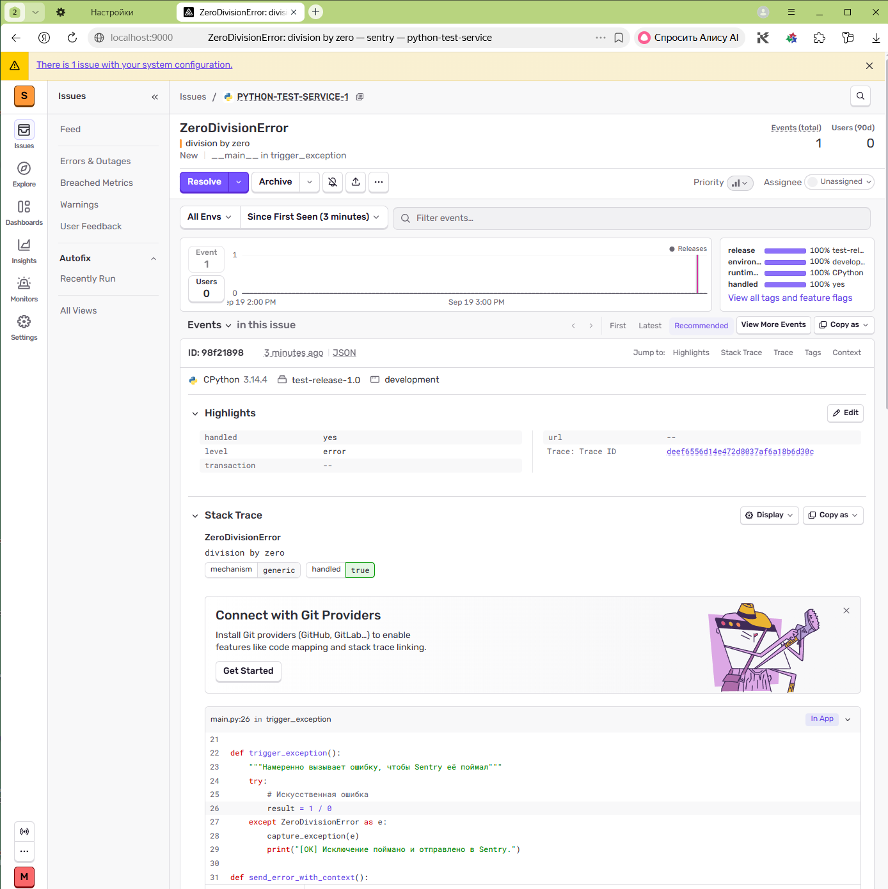
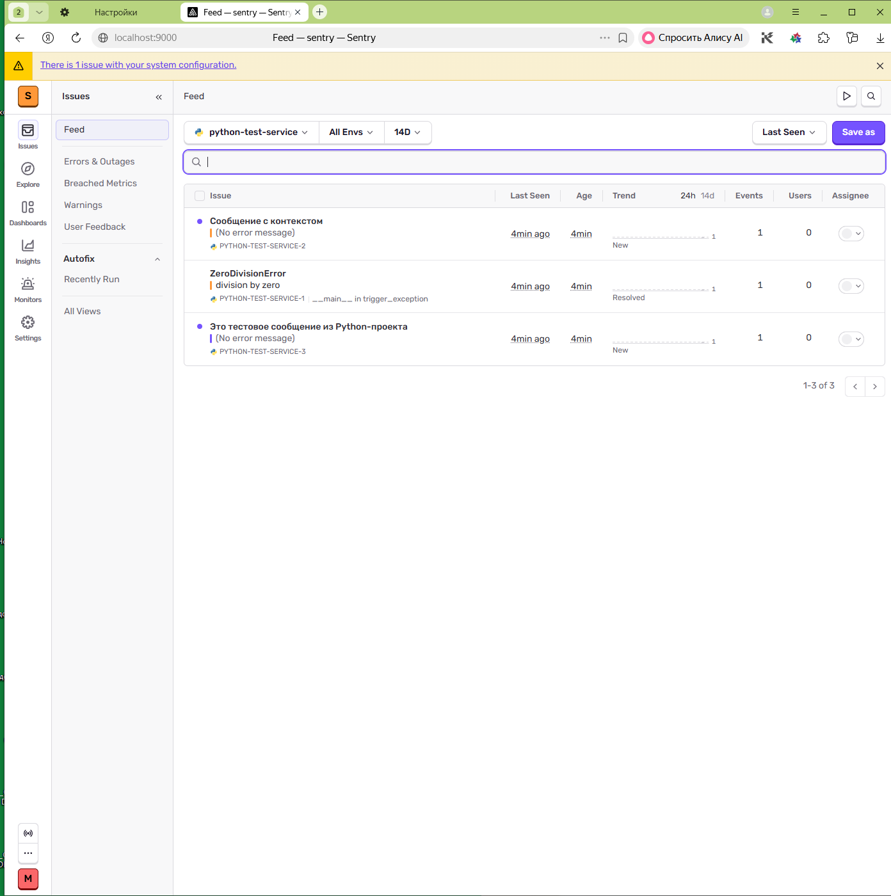
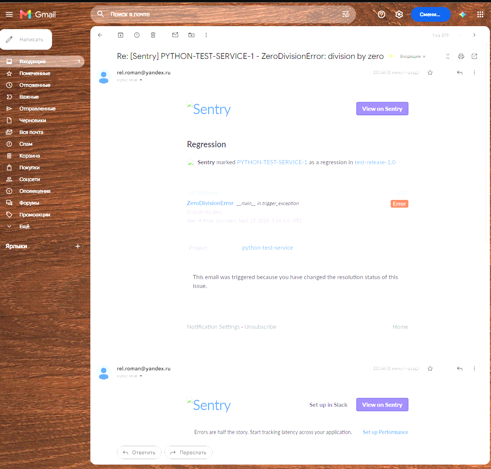

# Домашнее задание к занятию 16 «Платформа мониторинга Sentry»

## Задание 1

Так как Free Сloud account недоступен в стране даже с помощью трёх букв, то будем использовать Self-Hosted Sentry выделяя ей 4 ядра процессора и 20+Гб оперативной памяти.

Для подключения к Self-Hosted Sentry:
- настроен WSL2 на Windows10 и Docker Desktop;
- склонирован Git-репозиторий sentry на Ubuntu-26.04;
- далее следовал инструкциям.

скриншот меню Projects: 

## Задание 2

скриншот `Stack trace` из этого события и список событий проекта после нажатия `Resolved`.

## Задание 3

