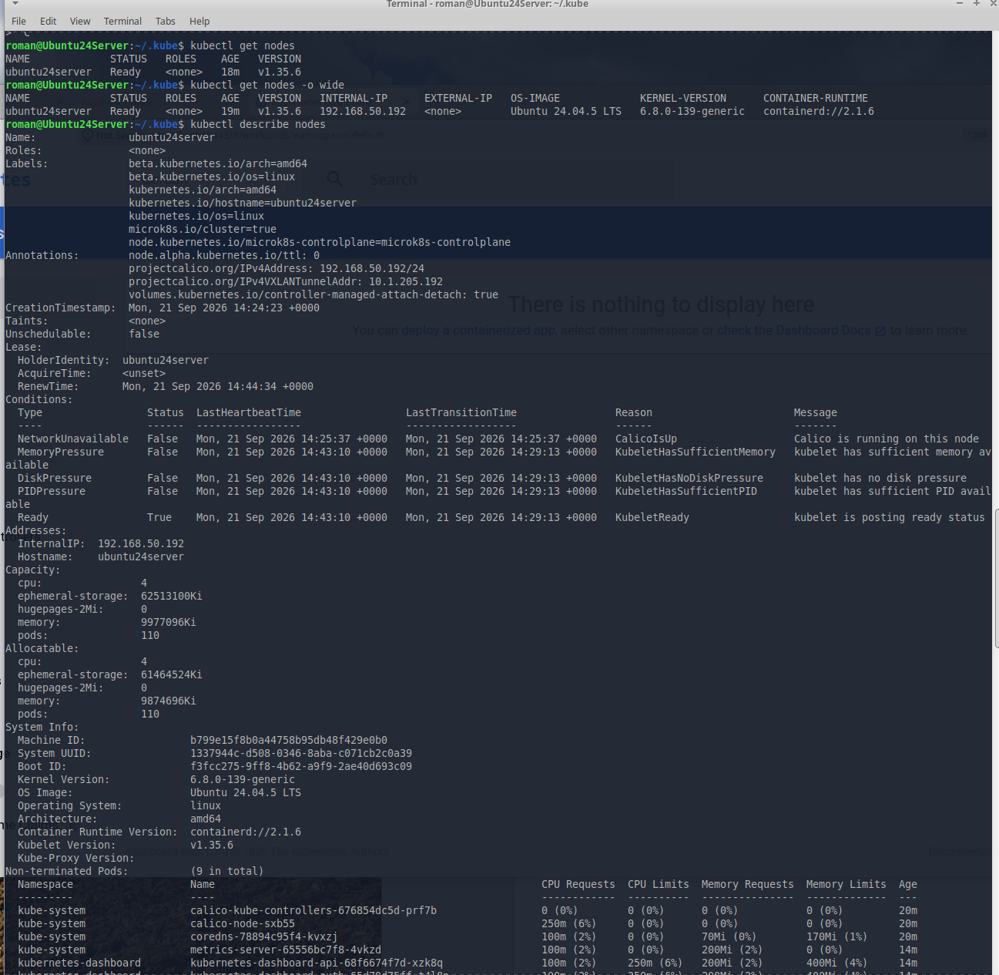
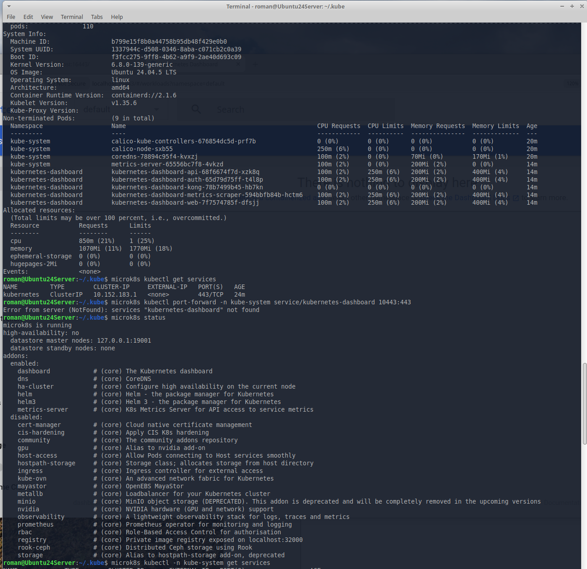
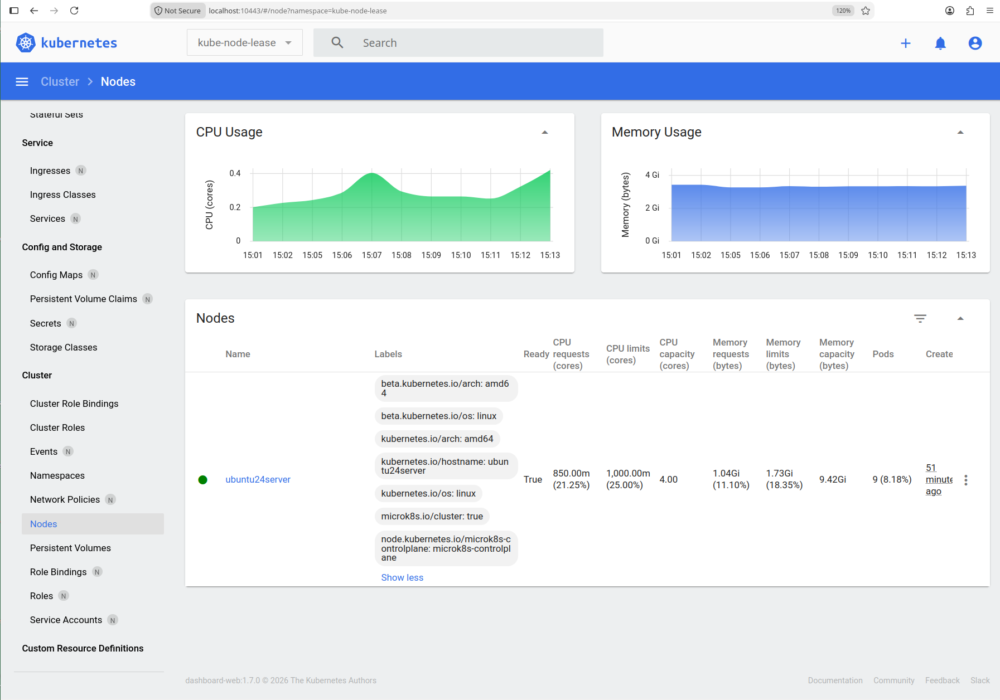

# Домашнее задание к занятию «Kubernetes. Причины появления. Команда kubectl»

-----
## Задание 1. Установка MicroK8S

------

## Задание 2. Установка и настройка локального kubectl

------

### Правила приёма работы

1. Домашняя работа оформляется в своём Git-репозитории в файле README.md. Выполненное домашнее задание пришлите ссылкой на .md-файл в вашем репозитории.
2. Файл README.md должен содержать скриншоты вывода команд `kubectl get nodes` и скриншот дашборда.

