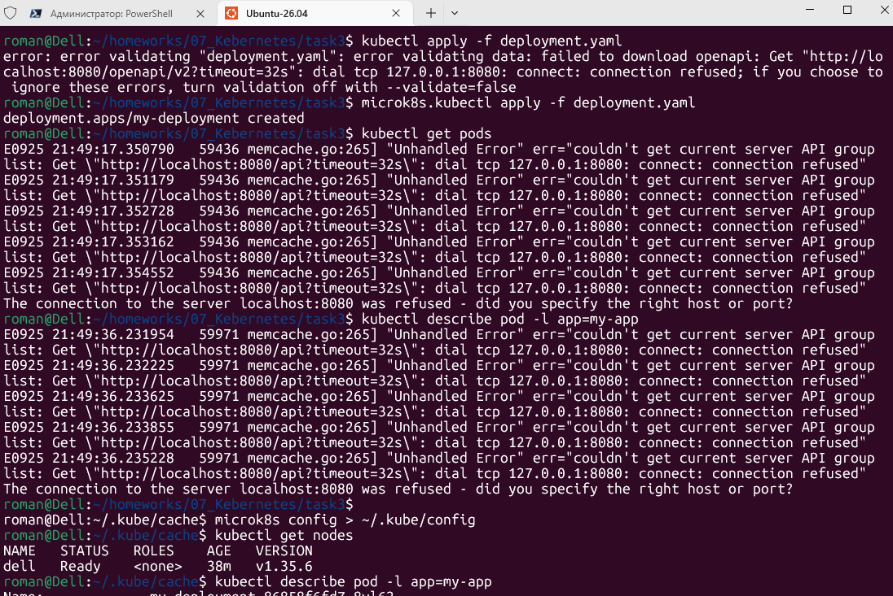
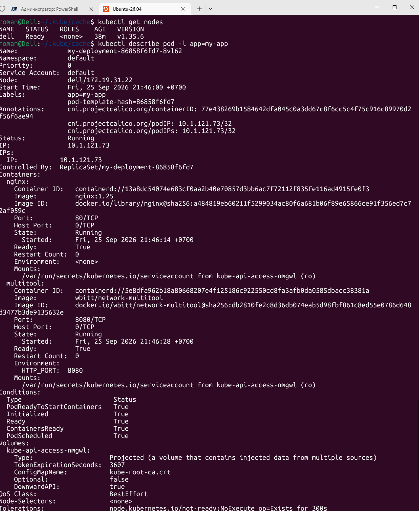
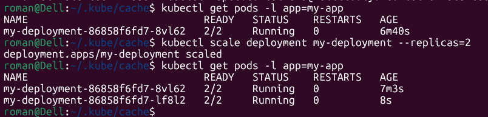
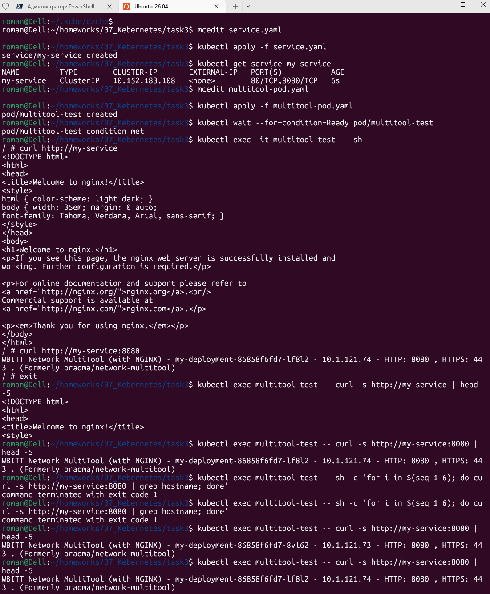
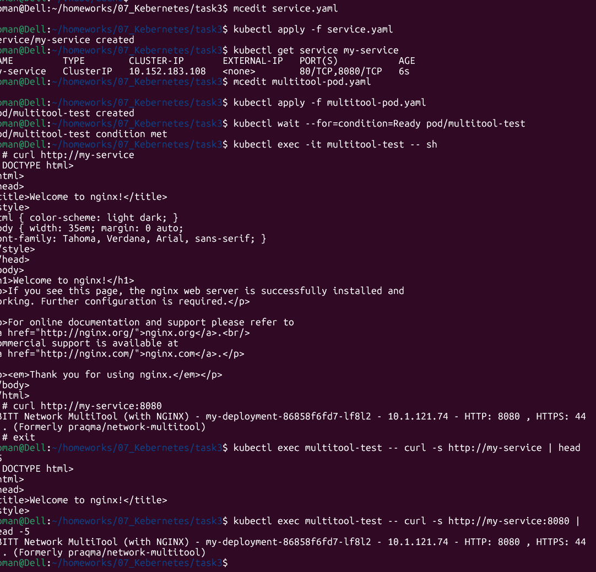
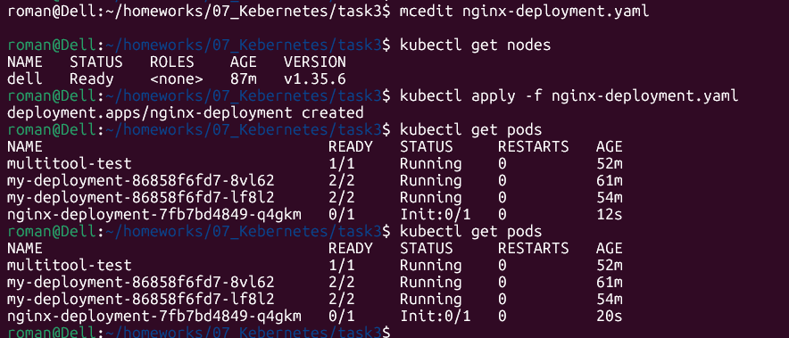
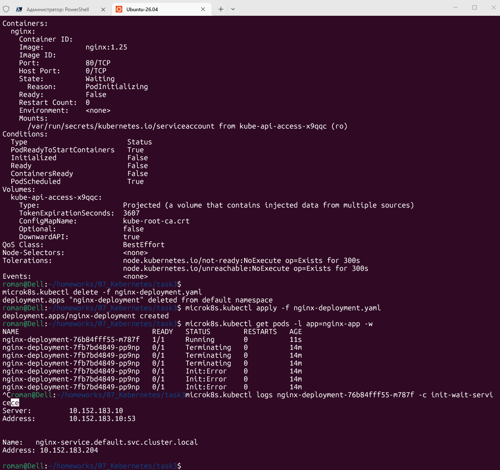

# Домашнее задание к занятию «Запуск приложений в K8S»

------

### Задание 1. Создать Deployment и обеспечить доступ к репликам приложения из другого Pod

1. Создать Deployment приложения, состоящего из двух контейнеров — nginx и multitool. 

Решить возникшую ошибку.
-системный kubectl был не настроен на MicroK8S — он шёл на localhost:8080, а MicroK8S слушал другой порт. 
После настройки microk8s config > ~/.kube/config заработало.

2. После запуска увеличить количество реплик работающего приложения до 2.
3. Продемонстрировать количество подов до и после масштабирования.

4. Создать Service, который обеспечит доступ до реплик приложений из п.1.

5. Создать отдельный Pod с приложением multitool и убедиться с помощью `curl`, что из пода есть доступ до приложений из п.1.

------

### Задание 2. Создать Deployment и обеспечить старт основного контейнера при выполнении условий

Продемонстрировать состояние пода до и после запуска сервиса.

До

После

------

### Правила приема работы

1. Домашняя работа оформляется в своем Git-репозитории в файле README.md. Выполненное домашнее задание пришлите ссылкой на .md-файл в вашем репозитории.
2. Файл README.md должен содержать скриншоты вывода необходимых команд `kubectl` и скриншоты результатов.
3. Репозиторий должен содержать файлы манифестов и ссылки на них в файле README.md.

------
