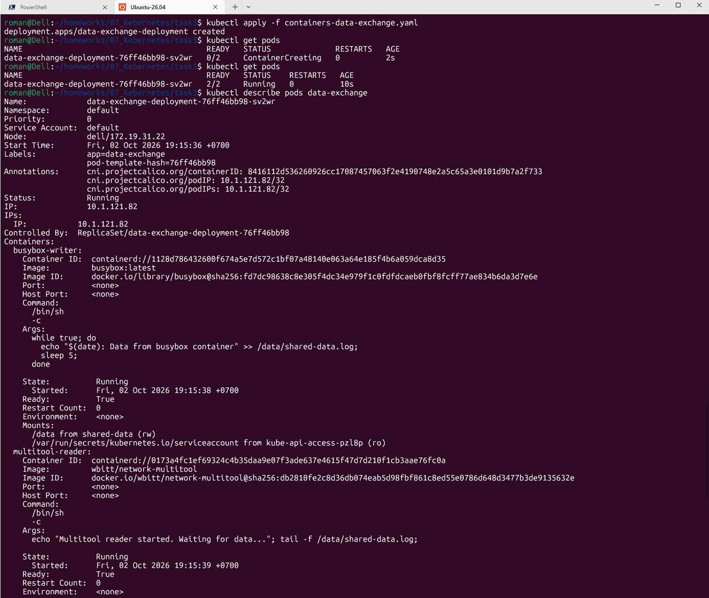
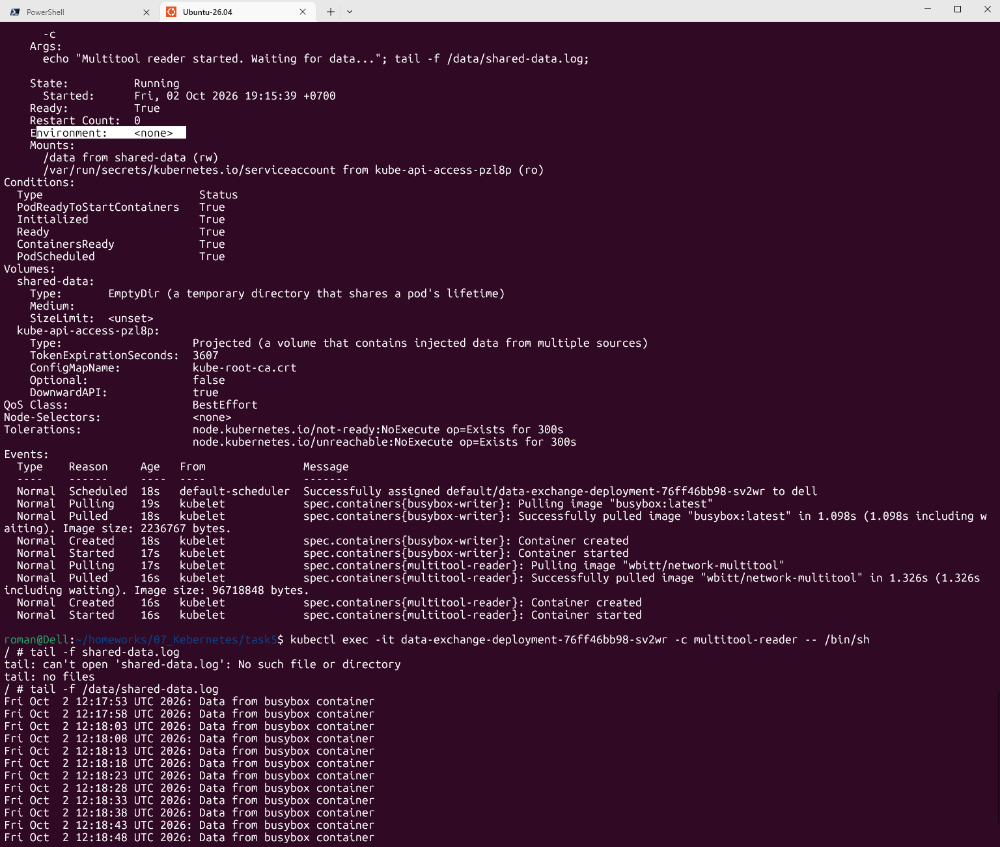
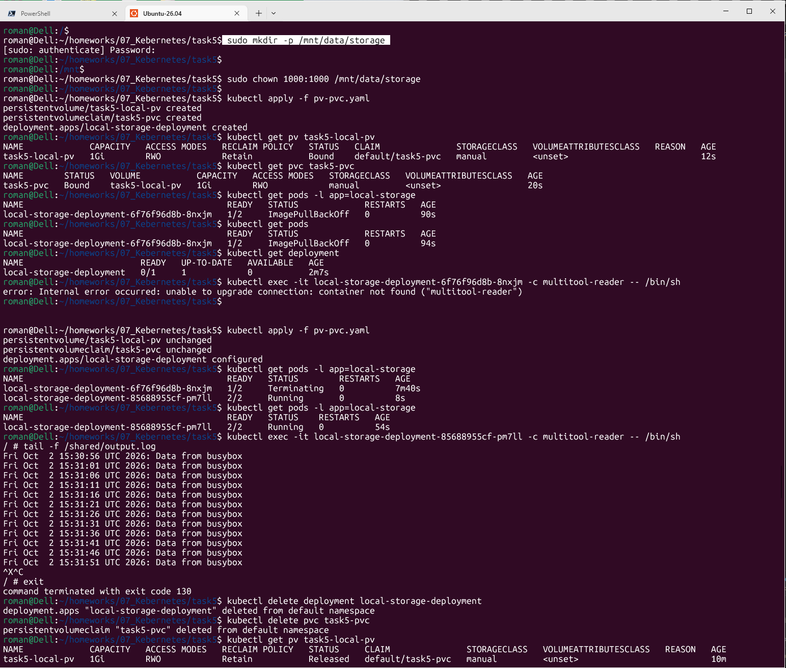
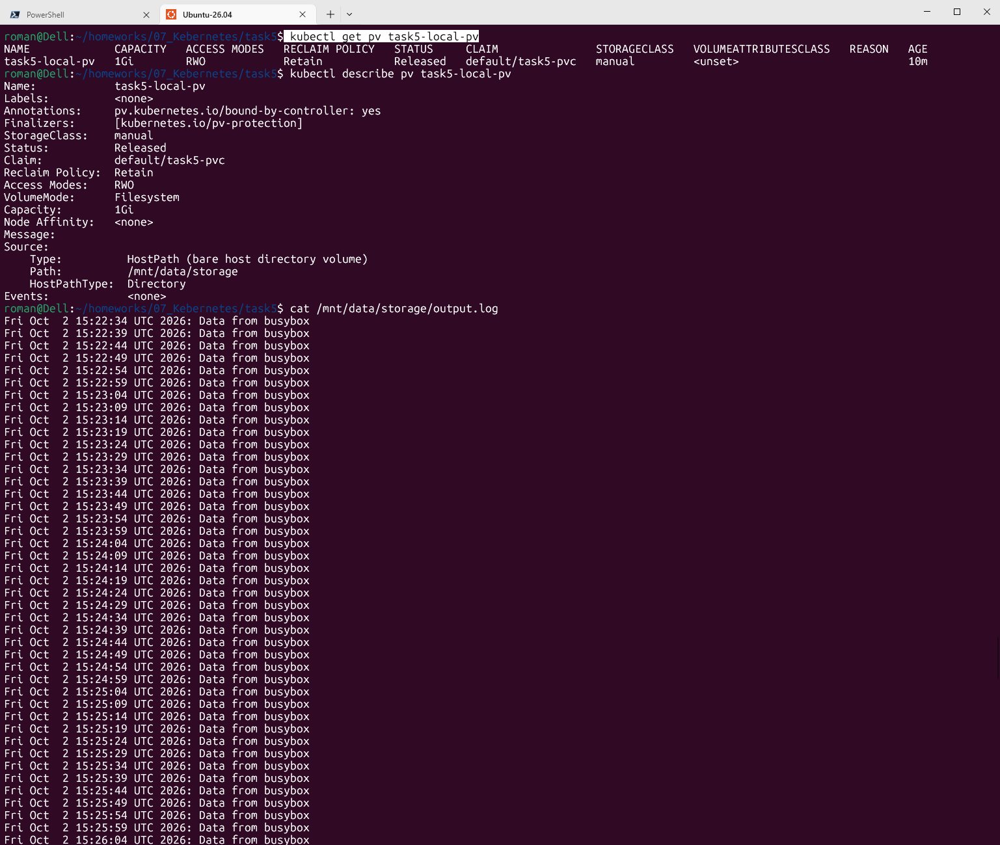
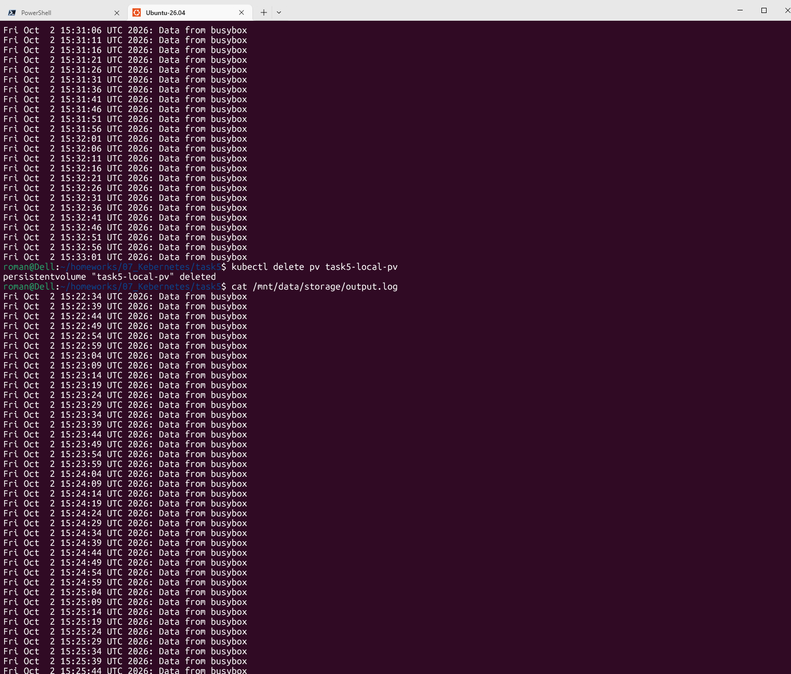
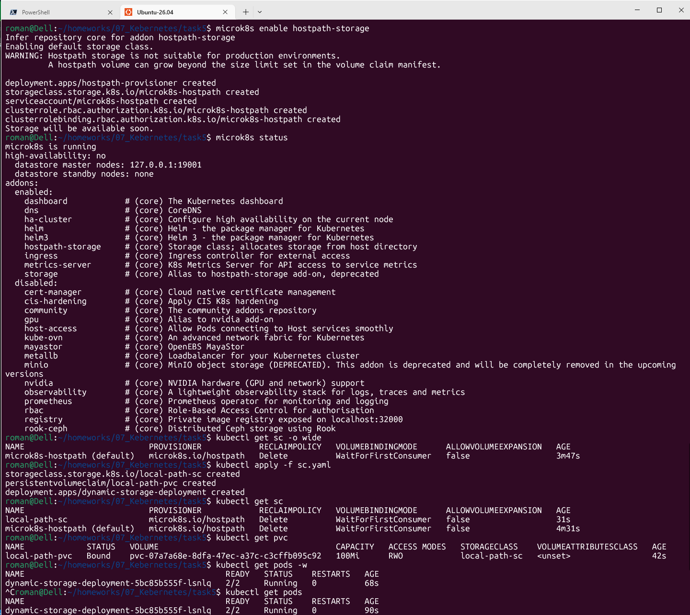
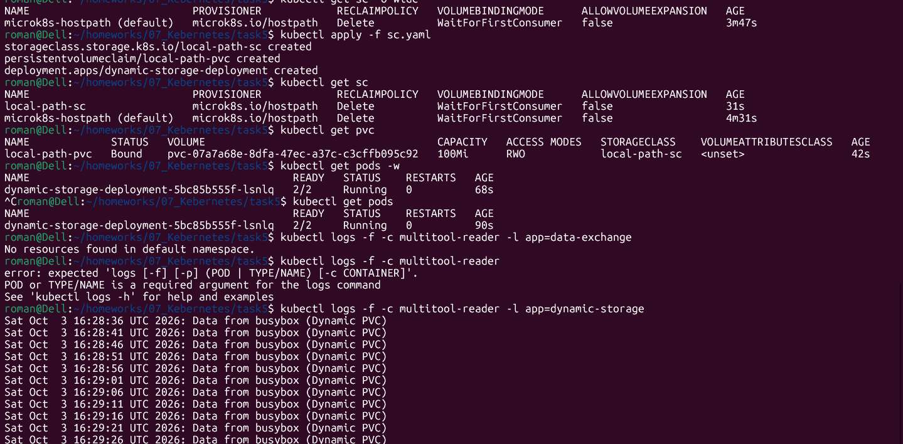
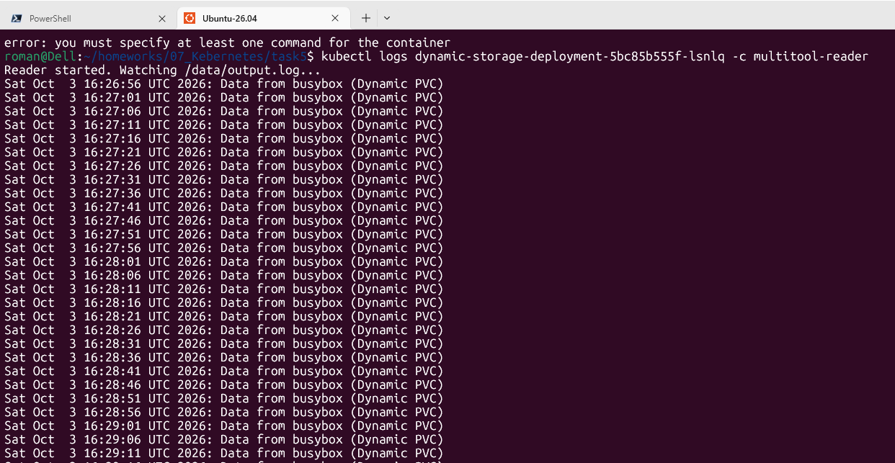

# Домашнее задание к занятию «Хранение в K8s»

## Задание 1. Volume: обмен данными между контейнерами в поде

Манифест:

- Скриншоты:

  - описание пода с контейнерами ('kubectl describe pods data-exchange')

  - вывод команды чтения файла (`tail -f <имя общего файла>`)

------

## Задание 2. PV, PVC

- Манифесты:

- Скриншоты:

Создать PV и PVC для подключения папки на локальной ноде, которая будет использована в поде.
Продемонстрировать, что контейнер multitool может читать данные из файла в смонтированной директории, в который busybox записывает данные каждые 5 секунд.

Удалить Deployment и PVC. Продемонстрировать, что после этого произошло с PV. Пояснить, почему. (Используйте команду kubectl describe pv).

Продемонстрировать, что файл сохранился на локальном диске ноды. Удалить PV. Продемонстрировать, что произошло с файлом после удаления PV. Пояснить, почему.

- Описания:

  - объяснение наблюдаемого поведения ресурсов в двух последних шагах.
Kubernetes управляет только объектами внутри себя. Параметр ReclaimPolicy: Retain означает: «Отвяжи объект PV от кластера, но не трогай данные на физическом носителе». Удаление ресурса PersistentVolume в Kubernetes — всего лишь удаление записи в API-сервере. 
Директория /mnt/data/storage на сервере ubuntu26 является частью файловой системы хоста, и Kubernetes не имеет прав или инструкций для её удаления. Чтобы полностью очистить данные, администратору нужно вручную удалить директорию на узле.

------

## Задание 3. StorageClass

- Манифесты:

- Скриншоты:

Создать SC и PVC для подключения папки на локальной ноде, которая будет использована в поде.

Продемонстрировать, что контейнер multitool может читать данные из файла в смонтированной директории, в который busybox записывает данные каждые 5 секунд.

