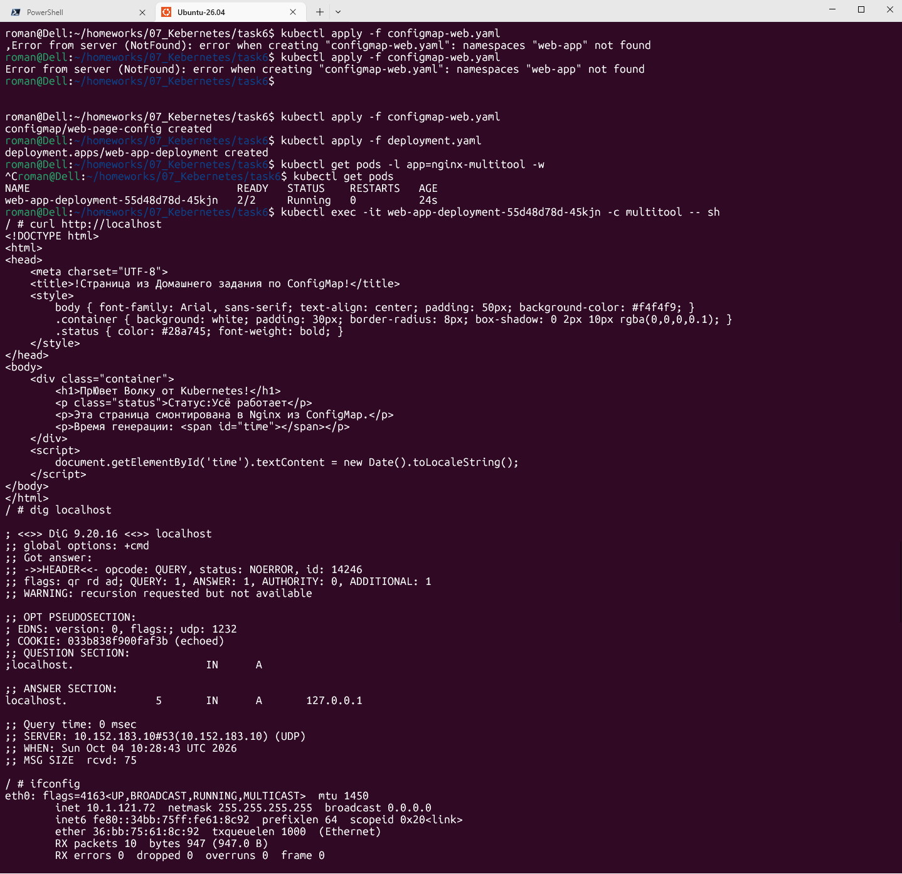
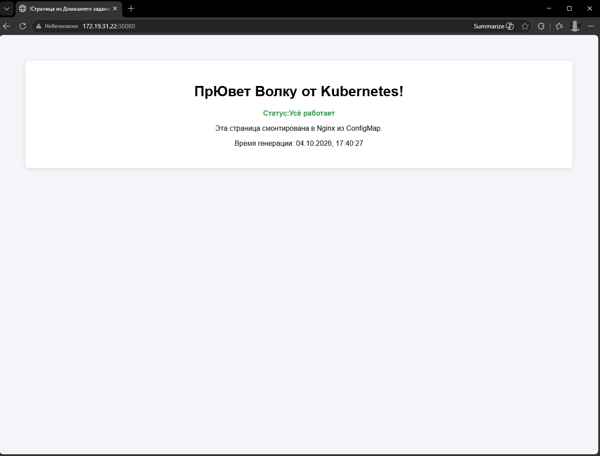
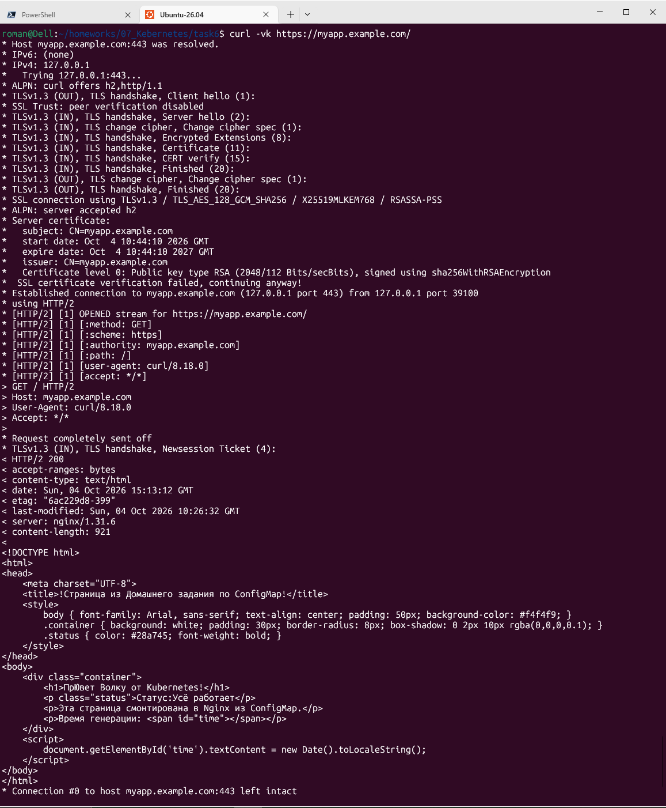
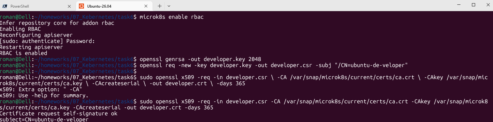
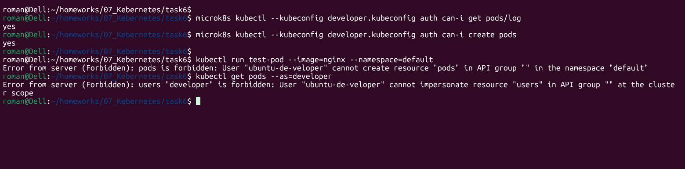

# Домашнее задание к занятию «Настройка приложений и управление доступом в Kubernetes»

## **Задание 1: Работа с ConfigMaps**

Развернуть приложение (nginx + multitool), решить проблему конфигурации через ConfigMap и подключить веб-страницу.

### **Что сдать на проверку**

- Манифесты:
  
  - `deployment.yaml`
  - `configmap-web.yaml`
  
- Скриншот вывода `curl` или браузера

---

## **Задание 2: Настройка HTTPS с Secrets**  

Развернуть приложение с доступом по HTTPS, используя самоподписанный сертификат.

- Манифесты:
  
  - `secret-tls.yaml`
  - `ingress-tls.yaml`
  
- Скриншот вывода `curl -k`

---

## **Задание 3: Настройка RBAC**  

Создать пользователя с ограниченными правами (только просмотр логов и описания подов).

- Манифесты:
  
  - `role-pod-reader.yaml`
  - `rolebinding-developer.yaml`
  
- Команды генерации сертификатов

- Скриншот проверки прав (`kubectl get pods --as=developer`)

