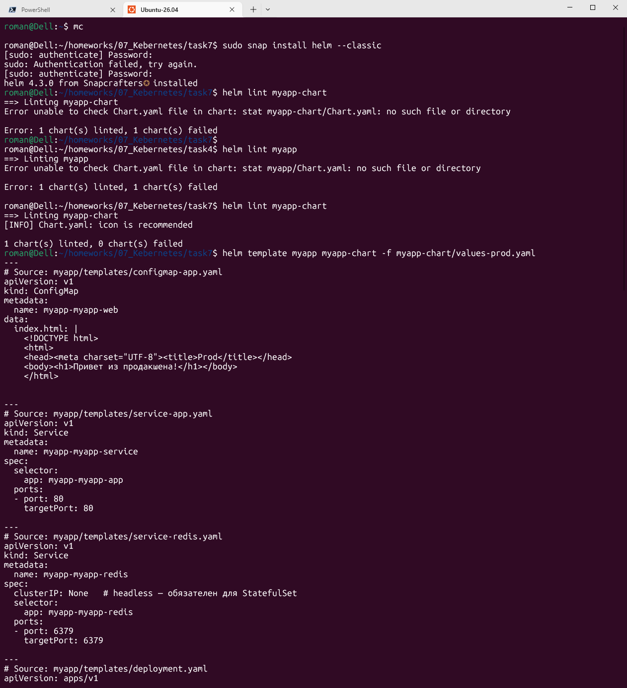
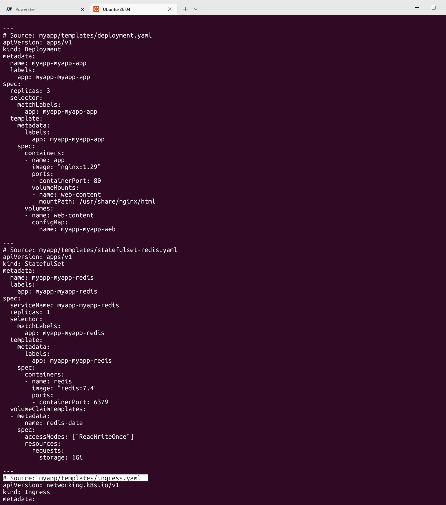
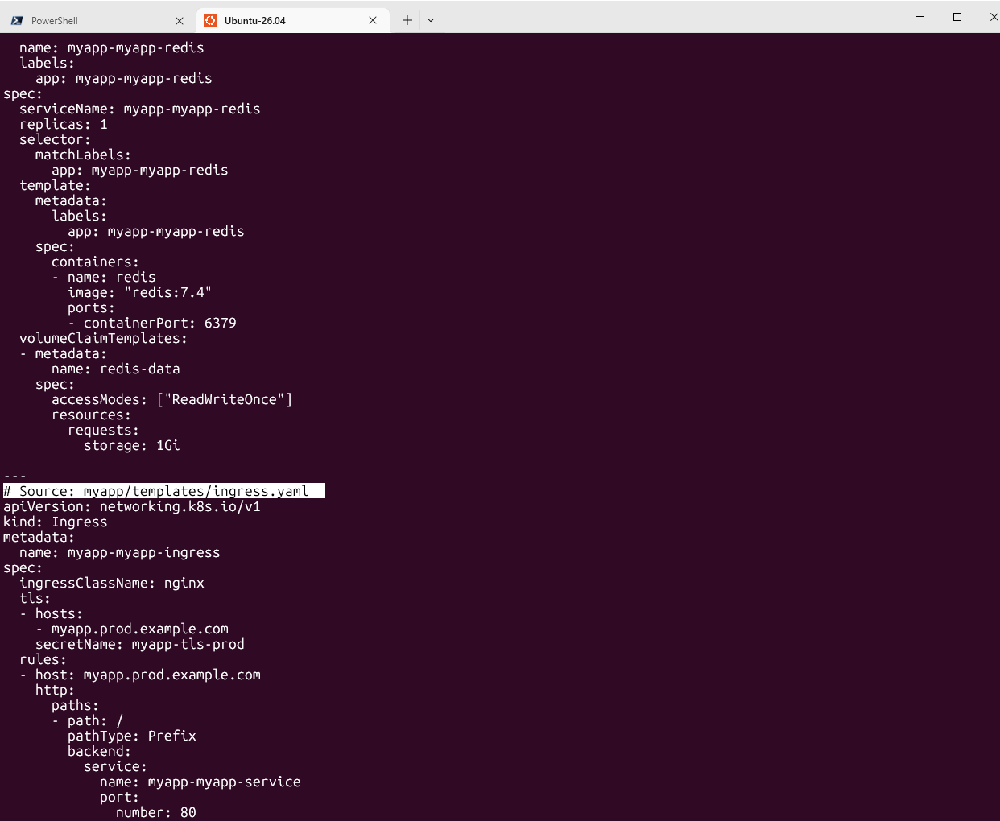
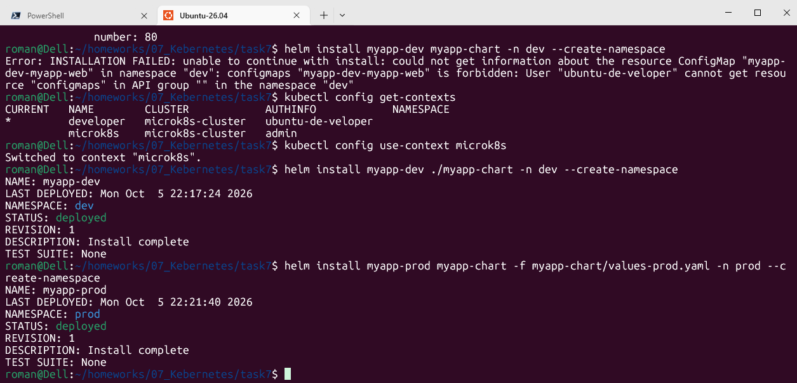
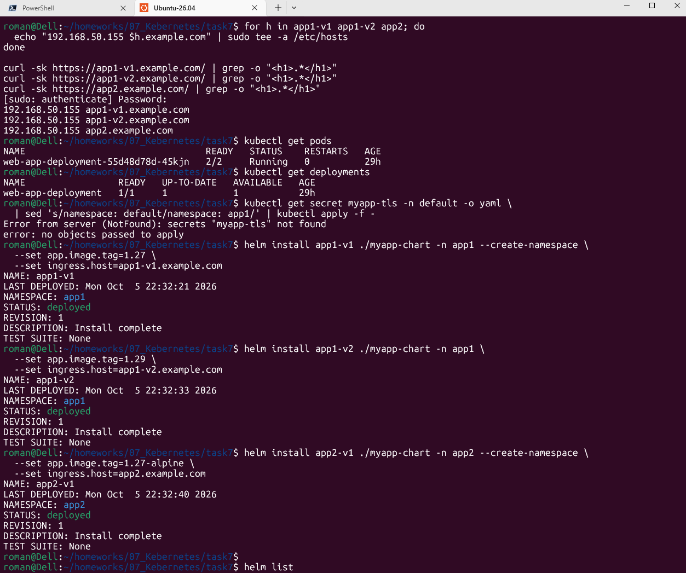
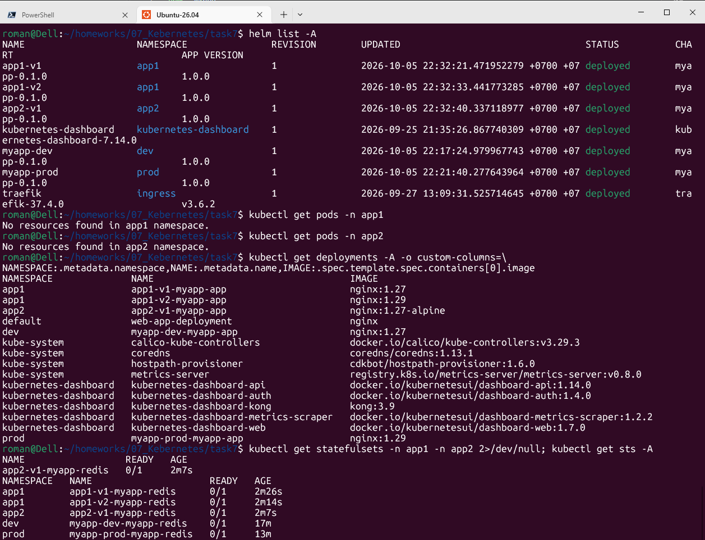

# Домашнее задание к занятию «Helm»

## Цель задания

В тестовой среде Kubernetes необходимо установить и обновить приложения с помощью Helm.

------

### Задание 1. Подготовить Helm-чарт для приложения

------
### Задание 2. Запустить две версии в разных неймспейсах

